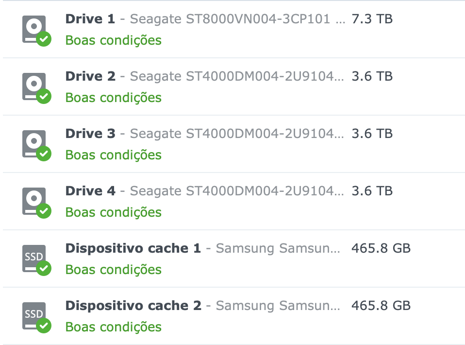

Title: Armazenamento Ligado à Rede, ou Network Attached Storage (NAS)
Date: 2023-10-29 21:30
Category: homelab

Um Network Attached Storage (NAS) ou Armazenamento Ligado à Rede é um sistema de armazenamento disponível para clientes ligados em rede. Podem ser equipamentos dedicados, como os NAS [Synology](https://synology.com) ou montados em hardware comum. O armazenamento geralmente consiste em discos rígidos magnéticos de grande capacidade.

Um NAS pode apresentar um único sistema de arquivos compartilhado via rede para os clientes ao montar os discos rígidos em sistemas de arquivos como [ZFS](https://pt.wikipedia.org/wiki/ZFS) ou [RAID](https://pt.wikipedia.org/wiki/RAID).

Eu uso um NAS Synology [DS920+](https://www.synology.com/en-br/support/download/DS920+?version=7.2#docs), oficialmente fora de linha e substituído pelo [DS923+](https://www.synology.com/en-br/products/DS923+), mas ainda totalmente funcional. Este NAS tem 4 baias para discos magnéticos e 2 baias para SSD para cache. Atualmente eu uso a seguinte configuração de discos:

O processador desta NAS é fraco para aplicações mais gerais, mas suficiente para rodar um servidor [SAMBA](https://pt.wikipedia.org/wiki/Samba_(software)), [NFS](https://pt.wikipedia.org/wiki/Network_File_System) e vários containers [docker](https://pt.wikipedia.org/wiki/Docker_(software)). Eu aumentei a memória para 12 GB de RAM.

Ele tem servido bem ao propósito, reduzindo o gasto de tempo em manutenção, em boa parte por causa do sistema operacional da Synology [DSM](https://www.synology.com/en-global/dsm). Eu tentei criar meu próprio NAS com um [Optiplex 7050](https://www.dell.com/support/manuals/pt-br/optiplex-7050-desktop/optiplex-7050-desktop-tower-owners-manual) e alguns discos rígidos magnéticos, mas o tempo gasto para colocar em operação e a capacidade reduzida não compensaram.
